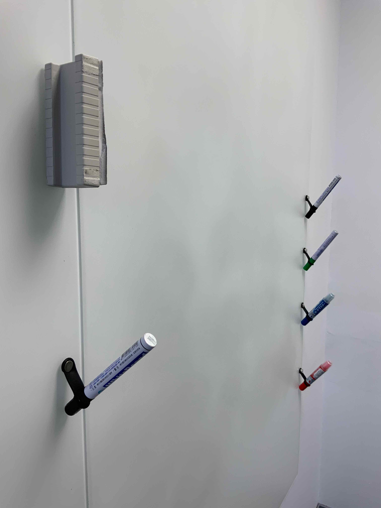
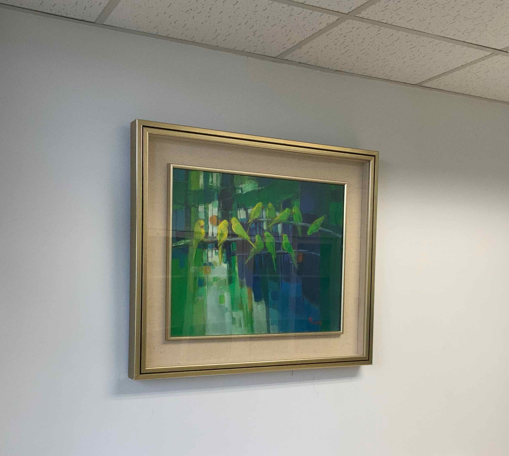
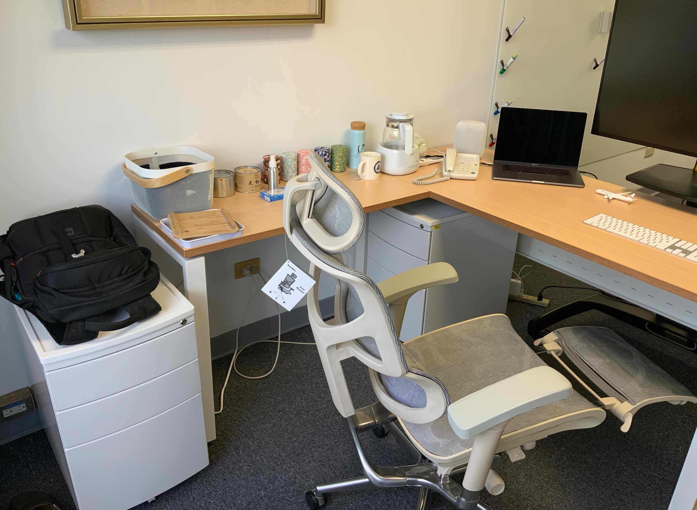

One nice thing that happened over the past few months was getting all the facilities I want in my office, of which this post is a quick tour.
Quite a few pictures are included.

## Office

The past two months were a bit hectic.
At the end of April I submitted my ‘[programming metamorphic algorithms](/#publication-68f26e05)’ paper to the [\<Programming\> journal](https://programming-journal.org).
And then I worked with a few of my new colleagues at IIS for most of May on another paper about a verified flash translation layer with almost deterministic crash behaviour, which was submitted to [OSDI](https://www.usenix.org/conference/osdi20); part of the theoretic material was covered in [0004](/blog/0004/) and [0007](/blog/0007/), but I had to rewrite the material in a ‘restrained’ manner so as not to intimidate the OSDI audience, which was an interesting experience.
And then it was PC work: I accepted the PC memberships of BX and DBPL, both of which were cancelled though; just when I thought I wouldn’t be in any PC this year except the [ICFP SRC](https://icfp20.sigplan.org/track/icfp-2020-student-research-competition), an invitation from [PPDP](http://www.cse.chalmers.se/~abela/ppdp20/) came, and half of June was gone as a result.
Meanwhile I also had to deal with FLOLAC matters, in particular the design of a new brand identity (which didn’t go as smoothly as I imagined), and a Ministry of Science and Technology grant proposal, which I could submit at any time (a privilege granted to new faculty members) but decided to submit asap in case I need the money.
Fortunately [Liang-Ting](https://l-tchen.github.io) joined me in May and shared some of the workload, for which I’m grateful.
I’m still occupied until mid-July, but after that I’ll get to work on a couple of new topics which I’ve wanted to look into for some time.

One nice thing that happened over the past few months was getting all the facilities I want in my office, of which this post is a quick tour.

For the meeting area, unlike a lot of my colleagues, who choose sofas to deliver a cozy feel, I decided to go with a working desk and office chairs (copying [Zhenjiang](http://sei.pku.edu.cn/~hu/)’s office at NII).
A few aircraft models are strategically placed on the desk for the guests to appreciate and play with.
The desk is more useful for the kind of discussion where people need to have notes, books, computers, etc in front of them, and also suitable for more casual occasions, especially when food and drinks are involved (although it’s not as cozy as sofas).
The desk’s pretty big (for the room) and doesn’t leave much space for a larger number of people (5–6 is pretty much the limit), but that’s a conscious decision:
I think it’s better to make the meeting area ideal for a smaller number of people to work together comfortably rather than making it possible to squeeze in more people but compromising the experience.
(If there’s need for a larger meeting, we can always borrow a meeting room.)

My predecessor left a small glass whiteboard, which is good but not enough,

so I installed a much larger one (3m x 1.8m) on an adjacent wall:

The big one is also a glass whiteboard, but the material is frosted glass, which greatly reduces light reflection and doesn’t obscure the writings like the small one does.
The frosted glass gets dirty more easily though — some residual black ink can already be seen in the photos above and below; other colours are even worse.

The pens and erasers can be placed anywhere on the whiteboard magnetically:

The silicone rubber bands holding the pens are originally designed for attaching a straw to a reusable cup, as shown in this gif (taken from [the cup’s project page](https://www.zeczec.com/projects/hiding)):

I own one of these cups, and when I was thinking about ways to put magnets on pens so that I can put the pens (or just their caps when I’m writing) anywhere I want on the whiteboard, the band came to mind naturally, as a whiteboard pen is topologically similar to a thick straw (shown in the gif above) commonly seen in Taiwan.
It took some time to find the right magnets, which have to be extra strong (required by the whiteboard).
However, the extra strong magnets alone are only barely enough because the whiteboard surface is slippery, and I had to add a ‘tissue coating’ (which can be seen in the two corners of the outward facing side of the eraser above) to increase friction.
Originally I planned to simply hang the pens with their caps pointing upwards, but that prevented the ink from reaching the tips.
And then I discovered the positioning shown in the photo, which is actually not as difficult as it looks but does require a bit of practice, and is therefore kind of fun; this way of positioning a pen also encourages people to pick up the pen and start writing, which reminds me of the ‘sense of deference’ that the first iMac’s handle gives.

The highlight of the wall opposite the big whiteboard is a painting of the Oirase stream in Aomori, Japan by my father.

What my guests usually notice first, though, is the big 43-inch 4K monitor ([LG 43UD79-B](https://www.rtings.com/monitor/reviews/lg/43ud79-b)) mounted on a floor stand with wheels.
(No, it’s not a TV.)
The monitor is usually connected to my MacBook Pro, which, by installing [AirServer](https://www.airserver.com), can act as an AirPlay or Google Cast receiver, so the guests can project their screens to the monitor wirelessly.
Due to the wheels, it’s easy to move the monitor around for different kinds of use.
My favourite mode is moving the monitor to the front of the Oirase stream painting so that it’s ideal for two people to collaborate, with the monitor at the front and the big whiteboard at the back.
[Tzu-Chi](https://github.com/Zekt) and I did this for the OSDI submission:

The size of the monitor strikes a good balance between shared (among a small group of people) and personal uses.
Here’s what it looks like when I’m sitting in my chair:

The 16-inch MacBook Pro has surprisingly good speakers, but I soon wanted more and eventually bought a HomePod myself, which quickly becomes indispensable, both for short breaks and long, tedious work.
Turning to the left, on the wall is another painting of my father’s,

and the things on the side desk below the painting are mostly about drinks,

including a variable temperature kettle, which can keep the water hot for Chinese tea brewing, a thermos bottle (which is a gift from [Zirun](https://ac.k331.one)) for cold water in summers, some Japanese tea tins, two cans of Wuyi tea from [Zhixuan](https://yangzhixuan.github.io), and my Chinese tea set (stowed in the white mesh basket).
The photo also shows my chair in the ‘dentist mode’, which is helpful when I’m tired but still need to work for a bit longer.
It also helps to turn around and take a look through the windows, which are opposite the [Genomics Research Center](https://goo.gl/maps/Bs7MVqUjQ98cYbSYA).

I’m really satisfied with all these facilities, and have to praise IIS for generously giving me what I had dreamed of: an office in which I can either work uninterruptedly by myself or engage in intensive discussion/collaboration with a small number of people, supplemented with tea and music.

---

But I don’t really know whether I’ll get enough guests to fully justify these.. 😓