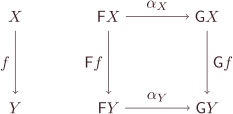
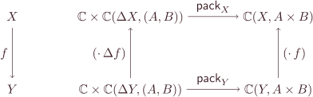

Naturality enters the picture as we prove that the two formulations of optimising definitions in terms of universality and isomorphism are equivalent.

## A study of adjunctions: Universality and natural isomorphism

In [0015] and [0016] we’ve seen that an optimising definition can be formulated in the form of universality or a family of isomorphisms.
To make the two forms interconvertible, however, there is one property missing: the family of isomorphisms should be a [natural isomorphism](https://en.wikipedia.org/wiki/Natural_transformation).
Specialised to products, this interconvertibility means that for objects $A$, $B$, and $A \times B$ in a category $\mathbb C$, the following two statements imply each other:

1. The [comma category](https://en.wikipedia.org/wiki/Comma_category) $\Delta \downarrow (A, B)$ has a terminal object $(\pi_\ell, \pi_r) : \Delta(A \times B) \to (A, B)$.
2. There is a natural isomorphism $\mathsf{pack} : \forall X.\ \mathbb C \times \mathbb C (\Delta X, (A, B)) \cong \mathbb C (X, A \times B)$.

Note that the formulation above is already quite general except that we’re using a specific functor $\Delta$ into a specific category $\mathbb C \times \mathbb C$ rather than a generic functor $\mathsf F : \mathbb C \to \mathbb D$.
We won’t be relying essentially on the specifics of $\Delta$ below, so formally our reasoning will work just fine for a generic functor, but hopefully by restricting to $\Delta$ it’ll be easier to connect the reasoning to our established intuitions about products.

### From universality to natural isomorphism

[0015] has already shown that the universality statement can be seen as a family of isomorphisms in disguise, so what’s missing in this direction is just the naturality.
The intuition for a natural transformation $\alpha : \forall X.\ \mathsf F X \to \mathsf G X$ is that $\alpha$ operates on a two-level structure, namely the object $X$ from a base category and the functor $\mathsf F$, and the effect of $\alpha$ is entirely at the functor level (transforming $\mathsf F$ to $\mathsf G$) and doesn’t depend on $X$; consequently, if there is some transformation $f : X \to Y$ to be applied at the base level alongside $\alpha$, it doesn’t matter in which order the two transformations are applied:

Starting from $\mathsf F X$, we can either

* apply the base-level transformation $f$ under $\mathsf F$, i.e., $\mathsf F f$, to get $\mathsf F Y$, and then apply the functor-level transformation $\alpha_Y$ to get $\mathsf G Y$, or
* apply the functor-level transformation $\alpha_X$ to get $\mathsf G X$, and then apply the base-level transformation $f$ under $\mathsf G$, i.e., $\mathsf G f$, to get $\mathsf G Y$,

and either route gives us the same result.
That is, we use the commutativity to capture the intuition that $\alpha$ and $f$ operate independently at two levels.

For $\mathsf{pack}$, the naturality we want to establish is

The functor $\mathsf G$ for $\mathsf{pack}$ is the contravariant hom-functor $\mathbb C (\text_, A \times B)$, which maps a source object $X$ to the set of morphisms of type $X \to A \times B$; a base transformation $f : X \to Y$ under this functor transforms (contravariantly) a morphism of type $Y \to A \times B$ to one of type $X \to A \times B$ which ‘preprocesses’ its input with $f$ before invoking the original morphism.
The functor $\mathsf F$ for $\mathsf{pack}$ is similar, so a base transformation under the functor is also some kind of preprocessing, although in this case we also have to duplicate the source change with $\Delta$.
The naturality can then be interpreted as saying that the two operations ‘$\mathsf{pack}$-ing morphism pairs into one’ and ‘preprocessing the morphism source’ are commutative.

Now suppose that we have universality, which says that any morphism pair $p : \Delta Y \to (A, B)$ can be uniquely factored through the same morphism pair $(\pi_\ell, \pi_r) : \Delta (A \times B) \to (A, B)$; that is, any $p$ can be rewritten in the canonical form $(\pi_\ell, \pi_r) \cdot \Delta g$ where the ‘core’ part $g$ is necessarily $\mathsf{pack}\ p$.
What’s interesting about this particular canonical form is that adding preprocessing $\Delta f$ to $p$ is the same as adding preprocessing $f$ to the core of $p$’s canonical form:

$$ p \cdot \Delta f = (\pi_\ell, \pi_r) \cdot \Delta g \cdot \Delta f = (\pi_\ell, \pi_r) \cdot \Delta(g \cdot f) $$

So, to compute the canonical form of $p \cdot \Delta f$, we don’t need to insist that preprocessing be added to the morphism before it’s $\mathsf{pack}$-ed into its core, because we can always add preprocessing to the $\mathsf{pack}$-ed core later — canonicity/universality guarantees that adding preprocessing afterwards will get us the same core as adding preprocessing beforehand.
Therefore it doesn’t matter in which order we do $\mathsf{pack}$-ing and preprocessing, which is exactly the naturality of $\mathsf{pack}$.

More formally:

To rewrite $p \cdot \Delta f$ into its canonical form, we can either directly $\mathsf{pack}$ the entire morphism, arriving at $(\pi_\ell, \pi_r) \cdot \Delta(\mathsf{pack}(p \cdot \Delta f))$, or $\mathsf{pack}$ only $p$ and then add preprocessing $f$ to the core $\mathsf{pack}\ p$, arriving at $(\pi_\ell, \pi_r) \cdot \Delta(\mathsf{pack}\ p \cdot f)$.
In either way we end up with a canonical form, and the cores of the two canonical forms, namely $\mathsf{pack}(p \cdot \Delta f)$ and $\mathsf{pack}\ p \cdot f$, must be equal.

### From natural isomorphism to universality

Conversely, given $\mathsf{pack}$ we want to show that every $p : \Delta Y \to (A, B)$ can be rewritten into the canonical form designated by universality (whose core should be unique).
Well, there is already an almost trivial canonical form: every $p$ can be rewritten as $\mathsf{pack}^{-1}(\mathsf{pack}\ p)$ where the $\mathsf{pack}\ p$ part cannot be anything else (because $\mathsf{pack}$ and $\mathsf{pack}^{-1}$ are inverse to each other).
Intuitively, $\mathsf{pack}^{-1}$ expands a core back to a morphism pair, and one possible way to do the expansion is plugging a core $f$ into the canonical form $\varepsilon \cdot \Delta f$ for some $\varepsilon : \Delta(A \times B) \to (A, B)$; if we can show that this is exactly what happens, namely $\mathsf{pack}^{-1}\ f = \varepsilon \cdot \Delta f$ for some $\varepsilon$, then we’re done.

The weapon available to us is the naturality of $\mathsf{pack}^{-1}$, which is the commutativity of $\mathsf{pack}^{-1}$ and preprocessing.
Again, there’s something interesting that makes preprocessing relevant here:
the domain of $\mathsf{pack}^{-1}$ is all the morphisms into a fixed object $A \times B$, so every such morphism $f$ can be seen as a piece of preprocessing for the identity morphism $\mathsf{id}\_{A \times B}$.
Thus by the naturality of $\mathsf{pack}^{-1}$, we can just apply $\mathsf{pack}^{-1}$ to the identity morphism and add whatever preprocessing we want afterwards instead of adding the preprocessing before $\mathsf{pack}^{-1}$:

$$ \mathsf{pack}^{-1}\ f = \mathsf{pack}^{-1}(\mathsf{id}\_{A \times B} \cdot f) = \mathsf{pack}^{-1}(\mathsf{id}\_{A \times B}) \cdot \Delta f $$

And this is exactly what we want, with $\varepsilon \defeq \mathsf{pack}^{-1}(\mathsf{id}\_{A \times B})$.

[0015]: /blog/0015/
[0016]: /blog/0016/ 