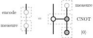
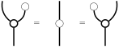

A (simple) construction that realises the principle of deferred measurement is described (and proved correct) in ZX-calculus.

## Deferred measurement

During the meeting of our quantum reading group last Thursday, a question about [deferred measurement](https://en.wikipedia.org/wiki/Deferred_Measurement_Principle) was brought up, and [Kai-Min](https://homepage.iis.sinica.edu.tw/~kmchung/) provided a construction explaining how it is done.
As a small exercise, this post describes the construction in the [ZX-calculus](https://en.wikipedia.org/wiki/ZX-calculus).
In fact, since the exercise is quite straightforward, this is more like an opportunity for me to typeset my first string diagram (using [TikZiT](https://tikzit.github.io)), and here’s the result (which follows the convention of [PQP](https://www.cambridge.org/gb/pqp)):

On the left is the [decoherence](https://en.wikipedia.org/wiki/Quantum_decoherence) process, which performs a measurement, destroying the ‘quantumness’, but encodes the classical measurement outcome back into a qubit for later computation.
Interestingly, this measurement can be taken off the wire as shown on the right:
Introduce an ancilla qubit and set it to $|0\rangle$ initially.
This ancilla qubit is then put into a perfectly correlated entanglement with the input qubit using a CNOT gate.
Because of the entanglement, the measurement can now be performed on the ancilla qubit instead, keeping the ‘quantumness’ of the original qubit (until the measurement takes place).
The equality of the two processes is a straightforward consequence of spider fusion.
What’s more interesting is Kai-Min’s insight into this construction: by moving the measurement to another wire, regardless of which process we perform subsequently on the original wire, it will necessarily commute with the measurement.
Mathematically, this commutativity is manifested clearly in the fact that we can deform the diagram on the right and make the measurement happen as late as we want.
(On the other hand, the measurement cannot be moved prior to the CNOT gate — it can be moved only backwards, not forwards.
This observation was the key to answering the question brought up at the meeting.)

One surprise for me was the use of CNOT, which I probably wouldn’t think of if I was asked to create the entanglement.
(To a native ZX-calculus user) a possibly more natural process to use here is the quantum copy spider, for which we can show (again easily by spider fusion) that measuring either of the two outputs yields the same result, which is the crux of the construction above:

The general problem here is the need of a compiler: given a ZX-diagram, can we find an equivalent one that is made up of physically realisable quantum gates?
(Alternatively, can we build a quantum computer that uses the ZX generators as primitives?
I have absolutely no idea about the answer though.)
Thanks to [van de Wetering’s wonderful survey about ZX-calculus](https://arxiv.org/abs/2012.13966v1)  that came out very recently, it’s easy to find out that the problem is a recognised one called the circuit extraction problem, covered in Section 6.6 of the survey, and a solution is described by Equations 104 there.