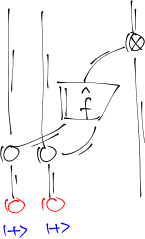
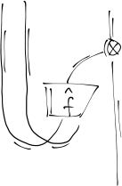
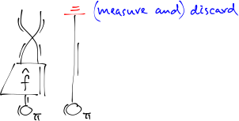
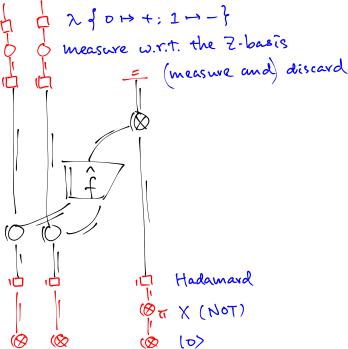

The Deutsch–Jozsa algorithm is one of the simplest quantum algorithms, although the traditional presentation is still rather obscure (at least to beginners).
With the help of the ZX-calculus, we can actually see that the algorithm is no more than a twisted form of a simple computation.

## Understanding the Deutsch–Jozsa algorithm

I started to write this post at the end of [ICFP 2022](https://icfp22.sigplan.org) in Ljubljana, Slovenia, where I presented the paper ‘[Datatype-generic programming meets elaborator reflection](/#publication-81a792a1)’, which is the result of a team effort with [Liang-Ting](https://l-tchen.github.io) and [Tzu-Chi](https://github.com/Zekt).
Hopefully this will be the start of a series of papers that revitalise dependently typed datatype-generic programming (in particular [ornamentation](/#publication-696aedff), of which I’m disappointed to see that there has been no satisfactory subsequent development while I was away and working on [bidirectional programming](/#publication-e124d6a0)), and eventually lead to a generic library that the practical Agda programmer will be happy to use.
After all these years, I’m still uncomfortable with chatting with random strangers, and did so only a few times at the conference (incidentally, this may have helped to reduce the risk of getting covid), but I can now chat pretty comfortably with people who I know at least to some extent, which is probably enough.

While working on the paper, I stopped blogging, again — the last time I worked on datatype-generic programming, which was for [my DPhil](/#publication-9c9a95f3), [my blogging](http://joshkos.blogspot.com) had also ground to a halt.
This is probably not a coincidence: datatype-generic programming is a research topic whose outcome is relatively predictable, so it’s easier to see what to do next and even make a realistic plan for a few years, which is perfect for a DPhil.
Once I have a plan, I feel the pressure to finish it on time and try to avoid ‘distractions’.
However, having been laid all out, the plan is not necessarily exciting, so I get trapped in something that I’m dedicated to finish but don’t feel the urge to write about in addition to the papers, and my blog dries up as a consequence.

But I’m not doing a DPhil anymore, and it’s healthier to get ‘distracted’ from time to time anyway, so here’s something unrelated to datatype-generic programming (and actually more exciting to me now):
I studied [PQP](https://www.cambridge.org/gb/pqp) again with my summer intern student Yi-Shiang Kuo along with Liang-Ting, and we made it to the chapter on quantum algorithms.
I think I see some insight from the diagrammatic representation of the Deutsch–Jozsa algorithm that would probably be difficult to see from the traditional presentation.
Based on the insight, the aim of this post is to give a different, and hopefully more straightforward, explanation of the algorithm.

---

One distinguishing feature of quantum computation is the ability to operate on states in superposition, which is often explained by analogy with parallel computation.
Given a classical function $f : \mathbf{2}^2 \to \mathbf{2}$ (where $\mathbf{2} \defeq \\{0, 1\\}$ and $\mathbf{2}^2 = \\{00, 01, 10, 11\\}$; the exponent $2$ is arbitrarily chosen for presentation purposes, and can be generalised), we can extend it to a linear map (also denoted by $f$) on the free vector space over $\mathbb{C}$ generated from $\mathbf{2}^2$ (also denoted by $\mathbf{2}^2$); in particular, we can apply $f$ to the uniform superposition of all the possible inputs

$$ f(|00\rangle + |01\rangle + |10\rangle + |11\rangle) $$

and (due to linearity) get the uniform superposition of all the outputs, as if we’re evaluating $f$ on all the possible inputs in parallel:

$$ |f(00)\rangle + |f(01)\rangle + |f(10)\rangle + |f(11)\rangle $$

Different from parallel computation, though, is that the evaluation results are summed together and not available separately — if we directly measure this state, we’ll get one of the results in random, which is not too useful.
A quantum algorithm has to make clever use of this sum somehow.

*Technical remarks.*
As per standard notation, we wrap vectors in ‘kets’ $|\cdot\rangle$, and $|00\rangle$ etc coincides with the tensor product $|0\rangle \otimes |0\rangle$ etc.
In this post we will only care about whether a state is possible or not (that is, whether its length is non-zero), and not about the exact probabilities, so we will not bother to normalise our states (that is, make their length $1$), and sometimes use equalities ‘$\approx$’ that are up to multiplication of a non-zero scalar to one side.
(*End of technical remarks.*)

In fact, we have more forms of sums at our disposal.
The above evaluation can be seen as part of the result of a *change of basis*.
Originally $f$ is defined by its behaviour on the ‘Z-basis’ (or ‘computational basis’) $\\{|00\rangle, |01\rangle, |10\rangle, |11\rangle\\}$.
But this is not the only basis of the vector space $\mathbf{2}^2$ — another typically used ‘X-basis’ is

\begin{align*}
|{++}\rangle &= |00\rangle + |01\rangle + |10\rangle + |11\rangle \\\\
|{+-}\rangle &= |00\rangle - |01\rangle + |10\rangle - |11\rangle \\\\
|{-+}\rangle &= |00\rangle + |01\rangle - |10\rangle - |11\rangle \\\\
|{--}\rangle &= |00\rangle - |01\rangle - |10\rangle + |11\rangle
\end{align*}

where

\begin{align*}
|+\rangle &\defeq |0\rangle + |1\rangle \\\\
|-\rangle &\defeq |0\rangle - |1\rangle
\end{align*}

are the X-basis of the vector space $\mathbf{2}$.
The uniform superposition of all possible inputs is exactly $|{++}\rangle$, which is distinct from all the other X-basis elements in the sense that all the others have exactly the same number of plus and minus signs.
The behaviour of $f$ can be investigated with respect to the X-basis as well.

The Deutsch–Jozsa problem is (artificially) designed to make the sums in the X-basis useful: assuming that $f$ is either *constant* (always producing the same output) or *balanced* (producing two $|0\rangle$ and two $|1\rangle$ as the outputs — in general the same numbers of $|0\rangle$ and $|1\rangle$), the aim is to decide which is the case.
It is immediately clear that a constant $f$ —let’s write this as $f_{\mathsf c}$— behaves very differently when applied to $|{++}\rangle$ compared to the other X-basis elements.
In a ‘pseudo-pattern-matching’ notation:

$$ \begin{array}{lcl}
f_{\mathsf c}\\;|{++}\rangle &\approx& |0\rangle \mathrel{\text{or}} |1\rangle \\\\
f_{\mathsf c}\\;\\_ &=& 0
\end{array} $$

That is, $f_{\mathsf c}$ produces $|0\rangle$ or $|1\rangle$ (multiplied by $4$, which is omitted) if applied to $|{++}\rangle$ (depending on the output of $f_{\mathsf c}$), or fails to produce anything if applied to any other X-basis element (because the numbers of plus and minus signs are equal and everything is cancelled out).
Note that the length of the state $|0\rangle$ is $1$, whereas the length of the state $0$ is $0$; the former is a perfectly normal state corresponding to the bit $0$, whereas the latter is an impossible state.

What about a balanced $f$ — let’s call it $f_{\mathsf b}$?
For $|{++}\rangle$, since the outputs consist of exactly two $|0\rangle$ and two $|1\rangle$, we have

$$ \begin{array}{lcl}
f_{\mathsf b}\\;|{++}\rangle &\approx& |+\rangle
\end{array} $$

For the other X-basis elements:
Applying $f_{\mathsf b}$ produces a $\pm 1$-weighted sum of two $|0\rangle$ and two $|1\rangle$.
If the two $|0\rangle$ get the same sign, the two $|1\rangle$ will both get the opposite sign, so the sum will essentially be $|-\rangle$; otherwise, everything is cancelled out.
So

$$ \begin{array}{lcl}
f_{\mathsf b}\\;\\_ &\approx& |-\rangle \mathrel{\text{or}} 0
\end{array} $$

That is, applying $f_{\mathsf b}$ to any X-basis element other than $|{++}\rangle$ will produce either $|-\rangle$ or nothing, which is again very different from the result of applying $f_{\mathsf b}$ to $|{++}\rangle$.

To decide whether $f$ is $f_{\mathsf c}$ or $f_{\mathsf b}$, the Deutsch–Jozsa algorithm asks just one clever question, which involves some kind of *backward evaluation* of $f$ on the X-basis: what is a possible input that allows $f$ to produce an output that ‘contains’ $|-\rangle$?
Here a state $|\varphi\rangle$ ‘contains’ another state $|\psi\rangle$ exactly when their inner product $\langle\psi|\varphi\rangle$ is non-zero.
(Think of $\langle\psi|\varphi\rangle$ as the result of some kind of test that detects the ‘amount’ of $|\psi\rangle$ in $|\varphi\rangle$ by projecting the latter onto the former, which is the geometric intuition of the inner product.)
How does an answer to the question help us?
If $f$ is $f_{\mathsf c}$, then the only possible input that produces any output is $|{++}\rangle$, and that output —be it $|0\rangle$ or $|1\rangle$— always contains $|-\rangle$, so the answer will be $|{++}\rangle$.
On the other hand, if $f$ is $f_{\mathsf b}$, then the answer cannot be $|{++}\rangle$, since the corresponding output $|+\rangle$ does *not* contain $|-\rangle$ — the answer will be something other than $|{++}\rangle$.
So by getting an answer to the question and checking whether it is $|{++}\rangle$ or not, we’ll be able to decide whether $f$ is $f_{\mathsf c}$ or $f_{\mathsf b}$.
The target state $|-\rangle$ is chosen so as to exclude $|{++}\rangle$ from the domain of $f_{\mathsf b}$, which then becomes disjoint from the domain of $f_{\mathsf c}$.

Mathematically that’s it, but computationally how do we perform the backward evaluation?
This is where the insight from the ZX-calculus starts to come in: quantum maps are pretty much ‘directionless’ (comparable to relational programming).
At this point it’s actually not too surprising yet — we know that linear maps (or matrices) can be transposed, thereby switching their domain and codomain; quantum maps are fundamentally linear maps, and can be transposed as well.
In ZX-calculus (à la PQP), we draw the (pure) quantum map $\hat f$ and its transpose as

For the quantum map $\hat f$, its two inputs flow in from the bottom through the two (thick) quantum wires, and its output goes out from the top wire; the transpose of $\hat f$ is the original diagram rotated by 180 degrees (with a twist to keep the outputs in the original order).
(I’m skipping a lot of details about the ZX-calculus, and in fact I’ve invented my own graphical notations to make ZX-diagrams easier to draw, but hopefully the high-level ideas are still recognisable.)
Applying the transpose to $|-\rangle$ (represented as a one-output Z-spider with phase $\pi$ below) gives us a quantum state representing the possible inputs that are mapped to $|-\rangle$ by $f$; we then measure this state with respect to the X-basis (performed by two bastard X-spiders below) to get one such input (in random, although the algorithm remains deterministic).
In ZX-calculus:

This is not something we can run on a quantum computer yet: the input state $|-\rangle$ and the measurement can be readily implemented as part of a quantum circuit, but the transposed quantum map cannot.
We have to encode a classical function such as $f$ as a quantum circuit, which serves as the input to the algorithm — traditionally this is called an oracle.
The standard oracle construction gives us a circuit $U_f$ such that

$$ U_f(|x\rangle \otimes |y\rangle) = |x\rangle \otimes |f(x) \oplus y\rangle  \qquad \forall x \in \mathbf 2^2, y \in \mathbf 2$$

where ‘$\oplus$’ is the exclusive-or operation on bits.
This specification can be directly transcribed into ZX-calculus:

where some input, intermediate, and output states are annotated in green to show the correspondence with the specification.
Note that this is merely a mathematical specification and cannot be implemented as a quantum circuit, but the construction gives a quantum circuit with equivalent behaviour.

Now the remaining problem is how we can extend the oracle diagram (that is, use the oracle as a black box) to express the application of the transpose.
Here is, I believe, where ZX-calculus shines.
We want the left part of the diagram to be just two wires connected to the outputs of the transpose of $\hat f$ —which are just the inputs of $\hat f$ because of the ‘directionlessness’— and it’s instinctive for a ZX-calculus user to plug in two $|+\rangle$ (represented as one-output Z-spiders in red below)

so as to trigger the spider fusion rule and get

We’re free to rearrange ZX-diagrams as long as connectivity doesn’t change, so we can directly rearrange the above diagram into a form that’s close to what we want:

Now we want the input to the transpose of $\hat f$ to be $|-\rangle$.
This is again easy for a ZX-calculus user — the one-input, two-output X-spider copies X-basis elements, so we can directly plug in $|-\rangle$:

The state is then copied by the X-spider, and we discard the extra one.

So we have found out how we can use the oracle to compute the application of the transpose.
To conform to the standard quantum circuit model, qubits should start with $|0\rangle$ and measurements should be performed with respect to the Z-basis.
But this is easy to fix by inserting Hadamards (represented as boxes) to switch between Z- and X-spiders.
In summary, the algorithm can be implemented as follows, by putting the red parts around the oracle:

I should confess that this derivation was worked out backwards from the solution given by PQP, although I think my derivation makes more sense than PQP’s.
And I do prefer my derivation to the traditional presentation that directly gives the final circuit and verifies what happens at each point of interest in the circuit:
To see why the Deutsch–Jozsa problem can be solved with just one superposition query, apart from a little bit of basic knowledge about quantum computing, all one needs are just the change to the X-basis and the revelation that backward evaluation is possible, and the rest is standard maths.
After figuring out what to compute mathematically, we then use the ZX-calculus to derive, quite straightforwardly, how to use the oracle to carry out that computation, so there is a clean separation between the analysis of the problem and the implementation of the solution as a quantum circuit, which is just a twisted form of the originally simple computation.
Most importantly, all the techniques including change of basis, backward evaluation, and the oracle encoding are general and intuitive enough that there is prospect to reuse them to understand old algorithms and invent new ones.
On the other hand, the Deutsch-Jozsa algorithm is pretty basic, and I’ll have to work on more realistic problems —in particular ones that involve probabilities— to make sure that what I’m doing is scalable.
But I’m happy that I have a correspondingly basic explanation now, which should be a good start.