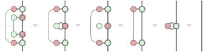

Two graphical presentations of quantum teleportation are given, one directly working with concrete definitions in ZX-calculus, and the other developing a higher-level structure.

## Quantum teleportation, graphically

In [PQP](https://www.cambridge.org/gb/pqp), [quantum teleportation](https://en.wikipedia.org/wiki/Quantum_teleportation) —where Alice sends a qubit to Bob using a shared EPR pair and two bits of classical communication— is used as a running example that gets developed in several stages together with the graphical quantum theory, culminating in a rather pleasing diagram in [ZX-calculus](https://zxcalculus.com):

*Convention.*
Here I’m following the bottom-up convention of PQP, and I’m drawing quantum wires as double lines (rather than thick lines as in PQP) at [Zhixuan](https://yangzhixuan.github.io)’s suggestion.
This reverses the notations for quantum and classical wires in traditional quantum circuits, but makes more sense intuitively (quantum wires carry more information) and mathematically (the doubling construction) when mixing quantum and classical processes. (*End of convention.*)

What I find pleasing is the symmetry between the Bell-basis measurement performed by Alice and the Bell map performed by Bob, which is made obvious only in the graphical presentation.
Teleportation can then be seen simply *and precisely* as Alice performing the measurement and Bob inverting that measurement.
I’ll expand this to the level of detail corresponding to traditional presentations —which give concrete definitions and resort to informal proses and low-level calculations to show that the definitions work— and then again but with some higher-level structure.

### Concrete definitions

The measurement performed by Alice is in the Bell basis, which has a nice graphical representation in ZX-calculus:

This is a function that produces one of the four Bell basis states when given two classical bits encoding the choice.
Take its adjoint by flipping the diagram vertically, and we get the Bell-basis measurement:

The diagram can be broken up to show how the measurement is implemented: as a CNOT followed by measurements in the X- and Z-bases.
Alice applies this measurement to the qubit to be sent and her half of the EPR pair, and the whole ‘marshalling’ process takes a qubit and turns it into two classical bits and a possibly altered qubit (now on Bob’s side):

This marshalling process is an isometry — that is, it can be inverted by its adjoint.
So we flip the diagram and pull the quantum wire straight to get the ‘unmarshalling’ process performed by Bob:

Again we can break up the diagram and see that the unmarshalling process can be implemented as conditional X- and Z-rotations depending on the result of Alice’s measurement.
It is easy to verify that marshalling is inverted by unmarshalling (using spider fusion and complementarity):

Summarising the entire diagram operationally: the measurement performed by Alice potentially changes the qubit Bob gets by non-deterministically applying Z- and X-rotations to the original qubit; whether any of the two rotations actually happens can be determined from the two classical bits resulting from the measurement, which should be sent to Bob so that he can undo the change by performing the counter-rotations.

This presentation helps to show the advantages of the graphical approach compared to traditional presentations.
Even just aiming at giving concrete definitions, what we need to conjure out of thin air is just the Bell basis, from which we can derive all the components of teleportation.
The derivations make full use of the ‘directionlessness’ and the finer-grained nature of ZX-diagrams (using spiders rather than gates as the basic building blocks):
The EPR pair is no more than a (horizontal) identity wire, and we can re-orient and break up the Bell basis diagram in different ways to see how marshalling and unmarshalling can be implemented.
In particular, it is immediately clear that CNOT and conditional X- and Z-rotations are the same process in different directions, which isn’t obvious in traditional presentations.
Finally, the isometry calculation is very clean, and yet readily proves the full correctness of teleportation.
By contrast, [de Wolf’s lecture notes](https://doi.org/10.48550/arXiv.1907.09415), for example, do not bother to give a complete calculation.
Moreover, de Wolf mentions that

> In fact, if Alice’s qubit had been *entangled* with some other qubits, then teleportation preserves this entanglement: Bob then receives a qubit that is entangled in the same way as Alice’s original qubit was.

This statement is not justified by de Wolf’s calculation, which assumes that the qubit to be sent is in the form $\alpha_0|0\rangle + \alpha_1|1\rangle$; on the other hand, the statement is a direct consequence of the graphical and point-free calculation.

### Higher-level structure

In PQP it takes about 550 pages to get to the final form of teleportation in ZX-calculus.
This might cause some misunderstanding that the graphical quantum theory needs a lot of setup just to be able to describe teleportation precisely, but in fact the 550 pages provide a gentle and pretty comprehensive introduction to various intuitions and corresponding mathematical structures of quantum theory (including a graphical reformulation of linear algebra).
These mathematical structures constitute an expressive language for us to talk about quantum computation at a higher level.
For teleportation, instead of just saying that ‘the Bell basis does the job’, we can talk about ‘why the Bell basis does the job’ by discussing more abstractly what are the key properties that make teleportation work.

Start again from the shared EPR pair (a ‘cup’ graphically), which is capable of transporting a qubit from Alice’s side to Bob’s.
To push the qubit from the left end of the EPR pair, a first instinct is for Alice to use a ‘cap’ and invoke the yanking equation:

This ‘cap’ is a purely mathematical entity and not physically realisable though.
At this abstraction level, a process is physically realisable if it is ‘causal’:

I find PQP’s discussion of causality not particularly enlightening, and choose to understand it simply in terms of its literal mathematical meaning, which is probability preservation:
Since quantum theory (in particular the notion of measurement) is probabilistic in nature, theoretically we can associate every state with a probability so that it is easier to keep track of all probabilities (see [0014](/blog/0014/) for more detail).
The discarding process on the right computes the probability of its input, so the definition of causality says that the output probability of the process is equal to the input probability.
In general a quantum process is non-deterministic, and can be thought of as a collection of processes that may happen with certain probabilities; mathematically, each of these component processes decreases the probability of an input state (because each process doesn’t happen with certainty), but jointly the output probabilities should sum to the input probability, meaning that all the possible outcomes have been considered, and the description of the whole process is complete.
Once a process is shown to be causal, there are then ‘dilation’ theorems that essentially implement the process as a unitary, linking back to the first postulate of quantum computing.

Back to what Alice can do: the cap is not causal because its causality would imply its separability, which would make the whole theory trivial in the sense that every process is constant (but quantum theory is non-trivial).

Instead, Alice should perform some kind of measurement $\hat M$ (there is no other choice).
Let us think about what this measurement should do.
It should transport the qubit on its left to its right, which may transform the qubit somehow, but the possible transformations should be invertible so that Bob can get back the original qubit.
In quantum computing pretty much everything is (at least at the core) unitary (which implies invertibility), so it’s kind of safe to surmise that the transformations are unitaries, except that these are ‘sideways’ unitaries, which we can express with the help of a cap (only for mathematical purposes):

Here $\hat U$ is the marshalling process above.
Its pure ingredient $U$ is a collection of unitaries with the first output acting as the index — by plugging in a basis state $k$, we get the $k$-th unitary $U_k$ in this collection:

Each of the unitaries should satisfy the usual unitarity laws, which can be expressed as two point-free equations

and

That is, for each unitary in the collection, its adjoint works as its left and right inverses.

The (sideways) unitarity turns out to be almost enough for what we want, and is therefore the key property.
First we can establish the correctness of teleportation, that is, the marshalling process is an isometry:

We can also establish that unmarshalling (the adjoint of marshalling) is causal (and thus physically realisable):

Note that we didn’t check the causality of Bob’s process in the previous presentation, where we simply examined what that process was made up of and saw that the components were familiar ones known to be physically realisable (which we didn’t actually verify).
Here we don’t have a concrete definition, but we can still verify the causality from what we think are reasonable properties that should be satisfied by Alice’s measurement.
We could even verify that the marshalling process is causal:

But this is not important for teleportation because what Alice performs is the measurement, which is only a part of marshalling, and it is the measurement that we need to verify to be causal.
The causality of the measurement is indeed stronger and needs to be separately verified: this causality is about whether the collection of unitaries fully constitutes a measurement, rather than the invertibility of each individual unitary.

To get back to the concrete definitions, we can verify that the choice of $U$ corresponding to the Bell basis

does satisfy the unitarity laws:

And of course we can verify that the Bell-basis measurement is causal:

### Concluding remarks

Teleportation does work nicely as a representative example of the graphical quantum theory (much like the role of maximum segment sum in program derivation), demonstrating the power and elegance of the graphical approach really well.
On the other hand, teleportation is often used as a first and simplest example of quantum computing, and seems to be dismissed by quantum algorithmics people, whose work, I suspect, relies on a somewhat different set of quantum idioms, for example the ability to perform measurements in non-standard bases (see [0027](/blog/0027/) and [0028](/blog/0028/)), as opposed to the ‘directionlessness’ crucial to teleportation.
More generally, it seems that the graphical quantum theory people have focused more on physical phenomena, and it is hard to say whether the theoretical tools they developed are useful for quantum algorithmics — this I’m hoping to find out.

---

Had a great time drawing all the diagrams using [TikZiT](https://tikzit.github.io) 😅
