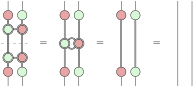

Another popular example that makes use of the Bell basis is dense coding, which is a name I find misleading though.

## Dense coding, graphically

Following up [0029](/blog/0029/), another popular example that makes use the Bell basis is [dense coding](https://en.wikipedia.org/wiki/Superdense_coding), which is usually advertised as Alice transmitting two classical bits to Bob by sending just one qubit, as if the qubit carried two classical bits of information (hence the name ‘dense coding’).
I find this description misleading though, which I’ll discuss after giving a graphical presentation of dense coding.

Like in teleportation, Alice and Bob share an EPR pair, and each of them uses the Bell basis in some way to send information through the EPR pair.
Different from teleportation, in this case Alice wants to send two classical bits, and the only way of using the Bell basis to do that is to apply it sideways as the Bell map (which is what Bob uses in teleportation) to Alice’s half of the EPR pair.
Alice then sends the resulting qubit to Bob, who inverts the Bell map using the Bell-basis measurement (which is what Alice uses in teleportation).

Dense coding is usually described as dual to teleportation because the roles of quantum and classical data are reversed (transmitting classical/quantum data by sending quantum/classical data).
Here we see that the duality goes further: the operations used by Alice and Bob are reversed as well (although this should already be apparent in the traditional presentation).
That is probably as far as duality goes though — when it comes to the correctness of dense coding, it is just a twisted version of the orthogonality of the Bell basis,

and has nothing to do with the sideways unitarity of the Bell basis, which is the key property in teleportation.
(The sideways unitarity is still essential though, since Alice needs to be able to use the Bell basis sideways, and therefore requires the causality of the sideways process, which is unitarity in disguise.)
Therefore what ‘dense coding’ really does is encode two classical bits in two qubits, and is not surprising at all.
Describing the process as sending only one qubit ignores the fact that a second qubit is sent through the EPR pair, and is misleading.
