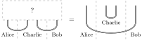
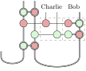
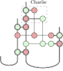
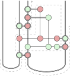
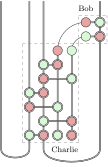

To complete the Bell basis trilogy, we also look at entanglement swapping, which, though slightly more complex, can be presented naturally in ZX-calculus.

## Fun with the Bell basis: Entanglement swapping, graphically

Continuing [0029](/blog/0029/) and [0030](/blog/0030/), it is also fairly straightforward to deal with [entanglement swapping](https://en.wikipedia.org/wiki/Quantum_teleportation#Entanglement_swapping), which can be seen as a spiced-up version of teleportation.
The problem is specified as follows: given two EPR pairs between Alice and Charlie and between Charlie and Bob, find a way to entangle Alice’s and Bob’s qubits, and leave an EPR pair for Charlie.

The instinctive first step is for Charlie to use the Bell-basis measurement to connect the two given EPR pairs sideways.
However, we should switch to the ‘non-demolition’ kind of measurement that leaves Charlie with his two qubits, so that it is possible to restore them to an EPR pair:

This non-demolition Bell-basis measurement is represented as the composition of the demolition version with its adjoint, with the measurement result retained.
The representation corresponds to an operational understanding: to measure a (bipartite) state in the Bell basis, we rotate the state to align with the computational basis (modulo a Hadamard) and reduce the measurement to a standard one; the measurement result (which is classical data) is then re-encoded as a quantum state, which is a pure computational basis state, and is ultimately rotated back to a Bell-basis state.
Now Charlie copies the measurement result and sends it to Bob so that Bob can perform the same correction as in teleportation:

And Charlie needs to perform his own correction (depending on the same measurement result) to restore his two qubits to an EPR pair:

(Another way to think about this is that any Bell-basis state is just a couple of rotations away from another, in particular the EPR pair.)
And that’s it!
The whole diagram may look slightly intimidating, but as marked below, it should be clear that we have constructed two paths going through rotations that are classically controlled (by the boxed part) to cancel out all the effects, forming the two required EPR pairs:

As a small exercise, if we want to obfuscate it a bit more, we can use the deferred measurement principle ([0018](/blog/0018/)) and turn Charlie’s process into a whole piece of quantum circuit, pulling the measurements to the top:

The correctness of this process should be evident by construction.
If we want to be absolutely sure, we can also do a brute-force but perfectly manageable calculation, which is just a lot of spider fusion and complementarity:

I can’t imagine how messy the construction and the calculation would be in the traditional linear-algebraic language. 😰
