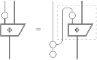

If the result of a measurement is a uniform distribution, then no quantum information is lost.
It turns out that this intuition can be straightforwardly formulated in the graphical quantum theory.

## The uniform measurement principle

I spent the last two Friday afternoons introducing a substantial amount of ZX-calculus and the graphical presentation of teleportation ([0029](/blog/0029/)) to a few quantum computing specialists, including [Kai-Min Chung](https://www.iis.sinica.edu.tw/~kmchung/).
When we reached the marshalling process, Kai-Min was baffled at first (by the quantum copying process, and in fact so was I, because the exact behaviour of quantum copying is still mysterious to me), but he quickly made sense of the process after I rewrote it to both a mixed form and a conventional quantum circuit (by expanding an ‘arm’ of quantum copying to a CNOT and an ancilla qubit).
Kai-Min reasoned informally that, since the results of the measurements are uniform distributions, they don’t extract information and make quantum states collapse like general measurements do; instead, the process should be thought of as applying one of the four sets of rotations uniformly randomly.
This reasoning is swiftly performed in ZX-calculus by pulling the bastard spiders downwards and turning them into uniform distributions whose results are copied and used to control the rotations:

This pulling can be done for any measurement, but it’s not the case that all measurement results are uniform, so there must be some condition satisfied by the marshalling process that makes this pulling physically meaningful, and the condition should be formulated as a general principle.
Abstractly, given a quantum process $\Phi$ with a part of its output measured (as depicted on the left-hand side of the equation below, where the dimensions of all the wires are arbitrary), we can always pull the measurement downwards and create a uniform distribution:

Mathematically we can immediately see the problem: the boxed part on the right —let’s call it ‘controlled $\Phi$’— is not necessarily causal because the cap is not causal, which is why the pulling doesn’t always work.
More generally, while mathematically we can freely pull wires downwards or upwards and switch their roles to input or output, the resulting process is not necessarily physical unless we can verify its causality, which puts restrictions on what is actually possible in quantum computing.
Now a gentle twist shows that the causality of the controlled $\Phi$ is equivalent to saying that the measurement result of $\Phi$ is uniform:

More precisely speaking, the right-hand side says that if we focus on the measurement result (classical output) by ignoring/discarding the quantum output, then the result will be a uniform distribution regardless of the input, which is discarded.
Mathematically the equivalence is no more than a gentle twist, but what’s interesting is its quantum-theoretic interpretation:
Kai-Min’s intuition is manifested in the right-to-left direction, which says that a classical wire which looks like a measurement but produces a uniform distribution is really a control wire that carries a classical input selecting which quantum process to perform.
Moreover, if $\Phi$ is pure, then the causality of the controlled $\Phi$ is equivalent to saying that the family of underlying linear maps indexed by the basis states of the control wire are all isometries (or even unitaries when the dimensions of the quantum input and output are the same), matching the intuition that quantum information is retained.
Conversely (from left to right), if the controlled $\Phi$ is causal, then (by discarding the classical output in the equation on the right) we know that $\Phi$ will be causal —that is, we can turn the control wire into a measurement— and the measurement result will be uniform.

Again, the graphical formulation of this principle benefits from the finer granularity and the directionlessness of ZX-calculus: spiders are so versatile that they can represent both measurement and uniform distribution, and wires can freely take the role of input or output before causality kicks in.
When I wrote [0029](/blog/0029/), I was indeed confused about whether the classical wires in the marshalling process should be primarily considered input or output.
Now I think the full answer is something like this: mathematically the direction can be set arbitrarily, but physically whether a wire makes sense as input or output is subject to causality.
In the case of the marshalling process, causality allows the classical wires to work in either role (control or measurement), which made it confusing, but this strange phenomenon can in fact be formulated as a general principle.
