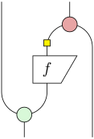
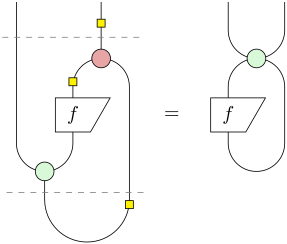
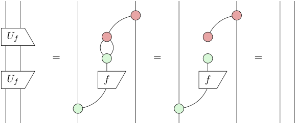

A naive and futile experiment in constructing a quantum program that I hoped to be easier to invent with the ZX-calculus.

## No free (quantum) lunch

As far as I can see, a unique characteristic of ZX-calculus is ‘directionlessness’, which I first noted in [0027](https://josh-hs-ko.github.io/blog/0027/).
This ‘directionlessness’ is also a defining characteristic of relational/logic programming, and indeed, linear maps and relations have a lot of similarities (especially when looking through the abstraction of [compact closed categories](https://en.wikipedia.org/wiki/Compact_closed_category)).
I’ve wondered whether it’s possible to exploit this common characteristic and link logic programming with quantum computing.
For example, in logic programming it is easy to specify the computation of a fixed point of a function (so, for instance, it is easy to [generate quines](https://doi.org/10.1145/3110252)).
Would it be possible to encode the function as a quantum oracle and then somehow augment it, in particular with entangled states, to express the constraint that specifies a fixed point?
If that’s possible, then there may be hope to express more kinds of constraint, eventually leading to a compiler from logic programs to ZX-calculus.

To specify the computation of a fixed point of a function $f$, we can connect the input and output of $f$, requiring them to be the same, and pull the value out of the loop:

It doesn’t seem possible to augment a standard quantum oracle $U_f$ to produce something close to this due to the different colours of the two spiders in $U_f$.
However, if we could tweak $U_f$ to $U'_f$ by adding a Hadamard

then we could augment $U'_f$ to produce something similar:

It’s easy to verify that the results of measuring the two outputs will be the same and will be a fixed point of $f$.

Things are looking too good to be true, however.
One thing that’s obviously suspicious and worth checking is the unitarity of the tweaked oracle $U'_f$.
The unitarity of the standard $U_f$ is proved (graphically) in [PQP](https://doi.org/10.1017/9781316219317) as Proposition 12.15.
Here’s an excerpt of the proof (without doubling):

The key step is the middle equality using complementarity.
For the tweaked $U'_f$, the added Hadamard appears on the two wires that are supposed to cancel out:

This blocks the use of complementarity, and the proof no longer goes through.
Intuitively at a formal level, the two spiders in $U_f$ having complementary colours is crucial in disentangling the two wires going out of $U_f^\dagger \circ U_f$ so that they become identity wires, whereas I need the two spiders to have the same colour to form the fixed-point loop.
This suggests that the idea of fixed-point loop is not realisable.

In fact, looking back, there have been signs along the way.
The tweaked oracle $U'_f$ is not essentially different from

which is easily interconvertible with $U'_f$ by sliding Hadamards into the top and bottom of the rightmost wire.
But this ‘fake oracle’ is obviously not causal (that is, it doesn’t account for all possibilities): the top-right Z-spider matches the output of $f$ and the input on the rightmost wire, and only produces a result when they are the same, which obviously isn’t always the case.
Looking back further, the matching spider has already appeared in the fixed-point loop, which therefore isn’t causal.
The whole attempt, sadly, has been naive and futile from the beginning.

One way to salvage something from this attempt might be to somehow complete the fixed-point loop to a causal process, and if $f$ is guaranteed to have a fixed point, then there’s some probability that the process will compute a fixed point of $f$, and we may be able to apply amplitude amplification to boost that probability.
On the other hand, instead of constructing the fixed-point loop using a cup and then completing it to a causal process and so on, why not just define the process *classically* as `λx. if f x == x then 1 else 0` and then apply Grover’s algorithm in the standard way?
If we’re lucky, the fixed-point loop construction might still have some benefits, which I doubt are going to be obvious, however.

So this is where I decide to stop, at least for now, and not just for this particular problem, but for my journey into ZX-calculus and quantum computing.
My current conclusion is that the insights I’ve got from ZX-calculus don’t seem to be enough for quantum algorithmics.
Thinking back, my attitude towards quantum computing has been somewhat sceptical, and it’s more like I’ve been evaluating whether it’s worthwhile to invest in quantum computing seriously.
Now seems to be a good point to end the evaluation: the barrier to do something significant remains high, and I’m not sufficiently motivated to invest more to cross the barrier.
